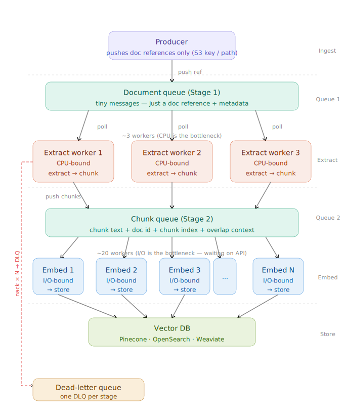
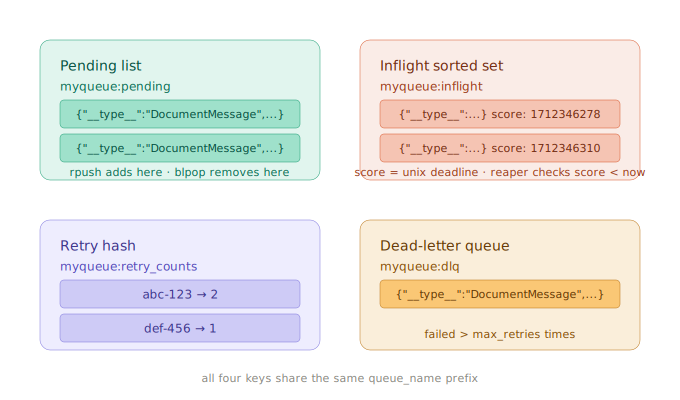
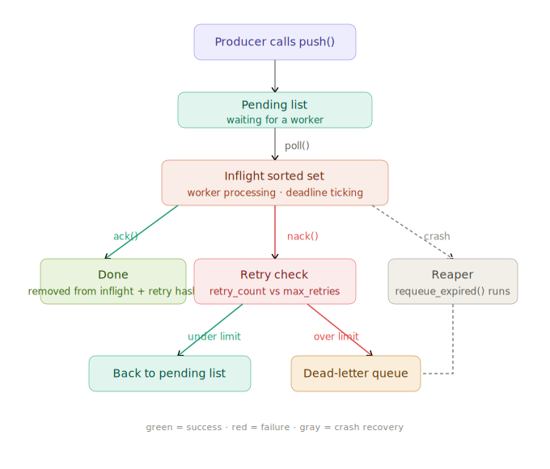

# Tributary

[](https://pypi.org/project/tributary-ai/)
[]()
[](https://pypi.org/project/tributary-ai/)
[](LICENSE)

**A lightweight, high-concurrency data ingestion and chunking pipeline for Retrieval-Augmented Generation (RAG) systems — runs single-process for small jobs, scales horizontally across machines for large ones.**

---

## The Problem

Building a RAG pipeline means wiring together document loading, text extraction, chunking, embedding, and vector storage — each with different APIs, async patterns, and failure modes. Most teams end up with brittle scripts that process files sequentially, can't handle mixed formats, and break silently when one document fails. When the job outgrows a single box, they throw it all away and rebuild on Spark or Airflow.

Tributary handles the plumbing so you can focus on your data. It processes documents concurrently, auto-detects file formats, batches embedding API calls, caches duplicate chunks, and reports exactly what failed and why. The same Python API runs on your laptop or sharded across a fleet of workers talking through Redis, SQS, RabbitMQ, Kafka, GCP Pub/Sub, or Azure Service Bus — you don't rewrite your pipeline to scale it.

## Two Ways to Run

| Mode | When to use | How it runs |
|------|-------------|-------------|
| **Single-process** | Laptops, batch jobs, < 1M documents | One Python process with an async producer-consumer queue |
| **Distributed** | Many machines, fault tolerance, unbounded throughput | Producer + N extraction workers + M embedding workers, coordinated by a shared message queue |

The single-process mode is the `Pipeline` class and is what most users want. The distributed mode is `DistributedPipeline` plus a `BaseQueue` backend of your choice. Both use the same sources, extractors, chunkers, embedders, and destinations — the difference is only the orchestration layer.

---

## Installation

```bash
pip install tributary-ai                    # Core only (~16 MB)
pip install tributary-ai[openai]             # + OpenAI embedder
pip install tributary-ai[pdf,s3]             # + PDF extraction + S3 source
pip install tributary-ai[redis]              # + Redis queue backend (distributed mode)
pip install tributary-ai[distributed]        # + All 6 queue backends
pip install tributary-ai[all]                # Everything
```

Optional dependency groups:
- **Sources**: `s3`, `gcs`, `azure`, `web`
- **Extractors**: `pdf`
- **Chunkers**: `sentence`, `token`
- **Embedders**: `openai`, `cohere`
- **Destinations**: `pinecone`, `qdrant`, `chroma`, `pgvector`
- **Queue backends** (for distributed mode): `redis`, `sqs`, `rabbitmq`, `pubsub`, `servicebus`, `kafka`, or `distributed` (all six)
- **Dashboard**: `dashboard`
- **Everything**: `all`

Import stays `import tributary` regardless of which extras you install.

**Docker:**

```bash
docker build -t tributary .
docker run -v ./docs:/app/docs tributary run --config /app/config/pipeline.yaml

# Or with docker-compose
docker compose up tributary
docker compose --profile dashboard up   # with live dashboard
```

---

## Quickstart

```python
import asyncio
from tributary.sources.local_source import LocalSource
from tributary.chunkers.fixed_chunker import FixedChunker
from tributary.embedders.custom_embedder import CustomEmbedder
from tributary.destinations.json_destination import JSONDestination
from tributary.pipeline.orchestrator import Pipeline

pipeline = Pipeline(
    source=LocalSource(directory="./docs", extensions=[".txt", ".md", ".pdf"]),
    chunker=FixedChunker(chunk_size=500, overlap=50),
    embedder=CustomEmbedder(embed_fn=lambda texts: [[0.0] * 384 for _ in texts]),
    destination=JSONDestination("output.jsonl"),
)

result = asyncio.run(pipeline.run())
print(f"Processed {result.successful}/{result.total_documents} documents in {result.time_ms:.0f}ms")
print(f"Metrics: {result.metrics}")
```

---

## Distributed Mode

When one machine isn't enough, Tributary splits the pipeline into two stages connected by a message queue. A producer reads the source and publishes document messages; any number of **extraction workers** (on any number of machines) pull from that queue, extract text, chunk it, and publish chunk messages; any number of **embedding workers** pull from the chunk queue, embed, and write to the destination.

<p align="center">
  
</p>

Each stage scales independently. Extraction is usually CPU/IO-bound (PDF parsing, disk reads), so you want many extraction workers. Embedding is network-bound and rate-limited by your embedding API, so you typically want fewer embedding workers but with high concurrency.

### Quickstart — distributed mode (Redis backend)

```python
import asyncio
import redis.asyncio as aioredis
from tributary.workers import DistributedPipeline
from tributary.workers.backends.redis_queue import RedisQueue
from tributary.sources.local_source import LocalSource
from tributary.extractors.text_extractor import TextExtractor
from tributary.chunkers.fixed_chunker import FixedChunker
from tributary.embedders.openai_embedder import OpenAIEmbedder
from tributary.destinations.qdrant_destination import QdrantDestination

async def main():
    redis_client = aioredis.from_url("redis://localhost:6379")
    document_queue = RedisQueue(redis_client, "docs", max_retries=3)
    chunk_queue = RedisQueue(redis_client, "chunks", max_retries=3)

    pipeline = DistributedPipeline(
        source=LocalSource(directory="./docs"),
        document_queue=document_queue,
        chunk_queue=chunk_queue,
        extractor=TextExtractor(),
        chunker=FixedChunker(chunk_size=500, overlap=50),
        embedder=OpenAIEmbedder(),
        destination=QdrantDestination(collection_name="docs"),
        n_extraction_workers=4,
        n_embedding_workers=2,
    )
    await pipeline.run()

asyncio.run(main())
```

Launch the same script on multiple machines pointing at the same Redis instance — each machine becomes another pool of workers drawing from the shared queues. `SIGINT`/`SIGTERM` triggers a clean drain: the producer stops publishing, workers finish their in-flight messages, and the process exits.

### Three ways to launch

| Way | Best for | How |
|-----|----------|-----|
| Python script | Full programmatic control, custom embedders, event callbacks | Instantiate `DistributedPipeline` directly (see snippet above) |
| CLI + YAML config | Ops-friendly, no Python required, config-as-code | `tributary run --config pipeline.yaml` — if the config has a `distributed` block, the CLI launches distributed mode automatically |
| Docker Compose | Zero-setup local dev, reproducible infra | `docker compose --profile distributed up --scale worker=4` — brings up Redis + N worker containers |

### Configuring distributed mode from YAML

If you'd rather drive the pipeline from a config file, add a `distributed` block to your `tributary.yaml` and the queues are built for you:

```yaml
source:
  type: local
  params: { directory: ./docs }

chunker:
  strategy: recursive
  params: { chunk_size: 500, overlap: 50 }

embedder:
  provider: openai

destination:
  type: qdrant
  params: { collection_name: docs, url: "http://localhost:6333" }

distributed:
  document_queue:
    backend: redis
    params:
      url: redis://localhost:6379
      queue_name: docs
      max_retries: 3
  chunk_queue:
    backend: redis
    params:
      url: redis://localhost:6379
      queue_name: chunks
      max_retries: 3
  n_extraction_workers: 4
  n_embedding_workers: 2
  poll_timeout: 1.0
```

Swap `backend: redis` for any of the six supported backends — schema validation catches typos and unknown backends before the pipeline starts. Under the hood, `get_queue(backend, **params)` lazily imports only the driver you asked for, so a Redis-only deployment doesn't need the SQS or Kafka libraries installed.

```bash
tributary run --config examples/distributed/config.yaml
```

The CLI detects the `distributed` block and wires up `DistributedPipeline` automatically. No Python required.

```python
# Building a queue from config by hand
from tributary.workers import get_queue

queue = get_queue("redis", url="redis://localhost:6379", queue_name="docs")
```

### Docker Compose — zero-setup local cluster

```bash
# Bring up Redis + 1 worker
docker compose --profile distributed up

# Scale to N worker containers (each runs the full pipeline — producer,
# extraction workers, and embedding workers — drawing from the shared
# Redis queues)
docker compose --profile distributed up --scale worker=5
```

The `distributed` profile starts a `redis:7-alpine` container and N `worker` containers built from the repo Dockerfile. Each worker runs `tributary run --config /app/config/config.docker.yaml` — the same CLI path as the YAML example, pointed at a Compose-specific config that uses `redis://redis:6379` (Compose service name) as the broker URL.

Mount your documents into `./docs` and collect results from `./output`. Press `Ctrl+C` to trigger a graceful drain — the producer stops publishing, workers finish their in-flight messages, then exit.

### Queue backends

Six production-grade backends ship today, each implementing the same `BaseQueue` contract (`push`, `poll`, `ack`, `nack`). Pick one based on what your infra already runs:

| Backend | Module | Install | Best for |
|---------|--------|---------|----------|
| **Redis** | `RedisQueue` | `redis` | Self-hosted, low latency, simple ops, explicit DLQ |
| **AWS SQS** | `SQSQueue` | `aioboto3` | AWS-native, managed, built-in visibility timeout |
| **RabbitMQ** | `RabbitMQQueue` | `aio-pika` | AMQP ecosystem, routing, durable queues |
| **GCP Pub/Sub** | `PubSubQueue` | `gcloud-aio-pubsub` | GCP-native, globally scalable, managed |
| **Azure Service Bus** | `ServiceBusQueue` | `azure-servicebus` | Azure-native, native delivery-count + DLQ |
| **Apache Kafka** | `KafkaQueue` | `aiokafka` | Log-structured, replay, very high throughput |

All backends provide:
- **At-least-once delivery** — messages are ack'd only after successful processing
- **Automatic retries** — failed messages are redelivered up to `max_retries` times
- **Dead-letter routing** — messages that exceed the retry limit are diverted to a DLQ
- **Retry counting** — every nack increments a counter so poison messages don't loop forever

### How a message moves through Redis

The Redis backend uses four data structures — a pending list, an in-flight sorted set, a retry counter hash, and a dead-letter list. Every message transitions through them as it's produced, picked up, processed (or failed), and finally acked or dead-lettered.

<p align="center">
  
</p>

The lifecycle for a single message, from push to ack:

<p align="center">
  
</p>

A separate `requeue_expired()` method reaps messages whose in-flight deadline has passed — this is what makes delivery at-least-once even if a worker dies mid-processing. The reaper uses an atomic Lua script (`ZRANGEBYSCORE` + `ZREM` in a single round trip) so multiple reapers can run without double-requeuing the same message.

---

## CLI

```bash
# Scaffold a new config interactively
tributary init --output pipeline.yaml

# Validate config without running
tributary validate --config pipeline.yaml

# Dry run — show what the config would do
tributary inspect --config pipeline.yaml

# Run the pipeline (with progress bar and rich output)
tributary run --config pipeline.yaml

# Benchmark throughput on sample data
tributary benchmark --docs-dir ./docs --chunk-size 500 --workers 3

# Estimate embedding API costs
tributary cost-estimate --docs-dir ./docs --model text-embedding-3-small

# Run with real-time web dashboard
tributary dashboard --config pipeline.yaml --port 8765
```

Example `pipeline.yaml`:

```yaml
source:
  type: local
  params:
    directory: ./docs
    extensions: [".txt", ".md", ".pdf"]

chunker:
  strategy: recursive
  params:
    chunk_size: 500
    overlap: 50

embedder:
  provider: openai
  params:
    api_key: your-api-key-here

destination:
  type: json
  params:
    file_path: ./output.jsonl

pipeline:
  max_workers: 3
  batch_size: 256

  # Resilience (all optional)
  state_store:
    path: .tributary_state.json
  retry_policy:
    max_retries: 3
    base_delay: 1.0
    max_delay: 30.0
  dead_letter_queue:
    path: .tributary_dlq.jsonl

  # Adaptive batch sizing (optional)
  adaptive_batching:
    initial_batch_size: 64
    min_batch_size: 8
    max_batch_size: 512
    target_latency_ms: 2000
```

Everything except `on_event` callbacks is configurable via YAML. For custom embedding functions, event callbacks, or multi-pass logic, use the Python API directly — see [examples/](examples/).

---

## Architecture

The building blocks are the same in both modes — `BaseSource`, `BaseExtractor`, `BaseChunker`, `BaseEmbedder`, `BaseDestination`. Only the orchestrator changes.

```
Source              Extractor          Chunker              Embedder          Destination
──────              ─────────          ───────              ────────          ───────────
LocalSource         TextExtractor      FixedChunker         OpenAIEmbedder    JSONDestination
S3Source            MarkdownExtractor  RecursiveChunker     CohereEmbedder    PineconeDestination
GCSSource           HTMLExtractor      SentenceChunker      CustomEmbedder    QdrantDestination
AzureBlobSource     CSVExtractor       TokenBasedChunker                      ChromaDestination
WebScraperSource    JSONExtractor      SlidingWindowChunker                   PgvectorDestination
                    PDFExtractor

    fetch() ────> extract() ────> chunk() ────> embed() ────> store()
         │             │              │             │             │
     async gen     auto-detect     thread        batched      concurrent
     + backpres    by extension    offloaded     + cached     + locked
```

**Single-process mode (`Pipeline`)** runs all five stages in one event loop with a bounded `asyncio.Queue` between the producer and workers.
**Distributed mode (`DistributedPipeline`)** splits the same five stages across two groups of workers connected by a `BaseQueue` — see the [Distributed Mode](#distributed-mode) section above.

---

## Feature Matrix

### Sources

| Source | Description | Auth |
|--------|-------------|------|
| `LocalSource` | Local filesystem, files or directories | None |
| `S3Source` | AWS S3 buckets with prefix filtering | AWS credentials |
| `GCSSource` | Google Cloud Storage with pagination | GCP credentials |
| `AzureBlobSource` | Azure Blob Storage containers | Connection string or account URL |
| `WebScraperSource` | HTTP/HTTPS URLs with concurrency control | None |

### Extractors

| Format | Extractor | Library |
|--------|-----------|---------|
| `.txt` | `TextExtractor` | Built-in |
| `.md`, `.markdown` | `MarkdownExtractor` | markdown-it-py |
| `.html`, `.htm` | `HTMLExtractor` | BeautifulSoup4 + lxml |
| `.csv`, `.tsv` | `CSVExtractor` | Built-in csv module |
| `.json` | `JSONExtractor` | Built-in json module |
| `.pdf` | `PDFExtractor` | PyMuPDF |

Extractors are auto-detected by file extension. All handle UTF-8 with Latin-1 fallback and log encoding issues with structlog.

### Chunkers

| Strategy | Class | Key Parameters |
|----------|-------|----------------|
| Fixed-size | `FixedChunker` | `chunk_size`, `overlap` |
| Recursive | `RecursiveChunker` | `chunk_size`, `overlap`, `separators` |
| Sentence | `SentenceChunker` | `sentences_per_chunk`, `overlap_sentences` |
| Token-based | `TokenBasedChunker` | `chunk_size`, `overlap`, `tokenizer` |
| Sliding window | `SlidingWindowChunker` | `window_size`, `step_size` |
| Conditional | `ChunkerRouter` | `default`, `rules` (by extension) |

**Conditional routing** — different chunking strategies per file type:

```yaml
chunker:
  strategy: fixed
  params: { chunk_size: 500, overlap: 50 }
  routing:
    ".pdf":
      strategy: recursive
      params: { chunk_size: 800, overlap: 100 }
    ".md":
      strategy: sentence
      params: { sentences_per_chunk: 5, overlap_sentences: 1 }
```

```python
# Python API
from tributary.chunkers.router import ChunkerRouter

router = ChunkerRouter(
    default=FixedChunker(chunk_size=500),
    rules={".pdf": RecursiveChunker(chunk_size=800), ".md": SentenceChunker()},
)
```

### Embedders

| Provider | Class | Default Model |
|----------|-------|---------------|
| OpenAI | `OpenAIEmbedder` | `text-embedding-3-small` |
| Cohere | `CohereEmbedder` | `embed-english-v3.0` |
| Custom function | `CustomEmbedder` | Any sync/async callable |

Need a different provider? `CustomEmbedder` accepts any sync or async function, so you can plug in Vertex AI, Bedrock, Voyage AI, or any other embedding API in one line.

### Destinations

| Destination | Class | Type |
|-------------|-------|------|
| JSON Lines | `JSONDestination` | File |
| Pinecone | `PineconeDestination` | Managed cloud |
| Qdrant | `QdrantDestination` | Self-hosted / cloud |
| ChromaDB | `ChromaDestination` | In-memory / local |
| pgvector | `PgvectorDestination` | PostgreSQL extension |
| Multi | `MultiDestination` | Fan-out to multiple destinations simultaneously |

**Multi-destination** — send embeddings to multiple destinations at once:

```yaml
# YAML config
destination:
  - type: json
    params: { file_path: ./backup.jsonl }
  - type: qdrant
    params: { collection_name: docs, url: "http://localhost:6333" }
```

```python
# Python API
from tributary.destinations.multi_destination import MultiDestination

destination = MultiDestination([
    JSONDestination("backup.jsonl"),
    QdrantDestination(collection_name="docs"),
])
```

---

## Performance Features

- **Concurrent workers** — N workers process documents in parallel via asyncio producer-consumer queue
- **Backpressure** — bounded queue (`queue_size`) pauses the producer when workers fall behind
- **Batched embedding** — chunks are grouped into configurable batches (default 256) to minimize API round trips
- **Concurrent embedding** — multiple embedding batches fire simultaneously per worker, controlled by semaphore (`max_concurrent_embeds`)
- **LRU embedding cache** — duplicate chunks (shared headers/footers) are embedded once and cached via `OrderedDict`
- **Thread-offloaded chunking** — CPU-bound chunking runs in `asyncio.to_thread` to avoid blocking the event loop
- **Per-stage metrics** — extraction, chunking, embedding, and storage are individually timed with min/avg/max stats
- **Event callbacks** — sync or async hooks for `pipeline_started`, `document_started`, `document_completed`, `document_failed`, `pipeline_completed`
- **Connection pooling** — all destinations use persistent connections via `connect()`/`close()` lifecycle, initialized once and reused across all batches
- **Adaptive batch sizing** — auto-tunes embedding batch size based on API response latency, halves on errors (rate limits/timeouts), respects min/max bounds
- **Lazy dependency loading** — optional packages (OpenAI, Pinecone, PyMuPDF, etc.) are only loaded when used, with interactive install prompts for missing dependencies

---

## Reliability & Resilience

```python
from tributary.pipeline.state_store import StateStore
from tributary.pipeline.retry import RetryPolicy, DeadLetterQueue

pipeline = Pipeline(
    source=..., chunker=..., embedder=..., destination=...,
    state_store=StateStore(".tributary_state.json"),
    retry_policy=RetryPolicy(max_retries=3, base_delay=1.0),
    dead_letter_queue=DeadLetterQueue(".tributary_dlq.jsonl"),
    checkpoint_interval=10,
)
```

| Feature | How it works |
|---------|--------------|
| **Document deduplication** | SHA-256 hash of content — already-processed documents are skipped on restart |
| **Idempotent restart** | `StateStore` loads from disk on init, pipeline resumes where it left off |
| **Retry with exponential backoff** | Failed documents retry up to `max_retries` times with `base_delay * 2^attempt` delay |
| **Dead-letter queue** | After all retries exhausted, failed documents are persisted to a JSONL file for inspection |
| **Checkpointing** | State saved to disk every N documents (configurable via `checkpoint_interval`) |
| **Graceful shutdown** | SIGINT/SIGTERM stops fetching new documents, finishes current work, saves state |

All resilience features are opt-in — configurable via YAML or Python API. Pass nothing and the pipeline works exactly as before.

---

## Observability

**Correlation IDs** — each document gets a unique 12-character ID that flows through every log line, making it easy to trace a single document across extraction, chunking, embedding, and storage stages.

**Cost estimation** — estimate embedding API costs before running:

```bash
tributary cost-estimate --docs-dir ./docs --model text-embedding-3-small
```

```python
from tributary.pipeline.cost_estimator import estimate_cost

est = estimate_cost(chunks, model_name="text-embedding-3-small")
print(f"~{est.estimated_tokens:,} tokens, ~${est.estimated_cost_usd:.4f}")
```

**OpenTelemetry export** — bridge pipeline events to Prometheus/Grafana/Datadog:

```python
from tributary.pipeline.otel_exporter import TributaryMetricsExporter

exporter = TributaryMetricsExporter(service_name="my-pipeline")
pipeline = Pipeline(..., on_event=exporter.on_event)
```

Exposes counters (`documents.processed`, `documents.failed`, `pipeline.runs`) and histograms (`pipeline.duration_ms`, `document.chunks`). Requires `opentelemetry-sdk` — gracefully no-ops if not installed.

**Real-time dashboard** — browser-based live view of pipeline progress:

```bash
tributary dashboard --config pipeline.yaml --port 8765
```

Opens a web dashboard at `http://localhost:8765` showing live document count, success/failure rates, docs/sec throughput, event log, and failure details — all streamed via WebSocket.

---

## Middleware / Hooks

Inject custom logic between pipeline stages without modifying the orchestrator:

```python
from tributary.pipeline.hooks import PipelineHooks

hooks = PipelineHooks()

@hooks.after_extract
def skip_tiny_documents(extraction, source_name):
    if extraction.char_count < 100:
        return None  # skip this document
    return extraction

@hooks.after_chunk
def filter_short_chunks(chunks, source_name):
    return [c for c in chunks if c.char_count > 50]

@hooks.before_embed
def normalize_text(texts, source_name):
    return [t.lower().strip() for t in texts]

pipeline = Pipeline(..., hooks=hooks)
```

| Hook | Receives | Can |
|------|----------|-----|
| `after_extract` | `ExtractionResult` | Modify text, skip document (return `None`) |
| `after_chunk` | `list[ChunkResult]` | Filter, reorder, modify chunks |
| `before_embed` | `list[str]` | Transform text before embedding |
| `after_embed` | `list[EmbeddingResult]` | Filter embeddings before storage |

Multiple hooks per stage chain in registration order. No hooks registered = zero overhead.

**Built-in: Chunk Quality Scoring** — detect and filter garbage chunks before they waste embedding API calls:

```python
from tributary.pipeline.quality import ChunkQualityScorer

scorer = ChunkQualityScorer(min_score=0.3)
hooks.after_chunk(scorer.as_chunk_filter())
```

Scores each chunk 0.0-1.0 based on 5 signals: length, whitespace ratio, alphabetic ratio, repetition, and sentence structure. Chunks below `min_score` are dropped before embedding.

---

## Examples

The [examples/](examples/) directory shows things the CLI can't do:

| Example | What it demonstrates |
|---------|---------------------|
| [`local_to_json.py`](examples/local_to_json.py) | Compare 3 chunking strategies on the same documents |
| [`pdf_recursive_chunking.py`](examples/pdf_recursive_chunking.py) | Two-pass pipeline with automatic retry on failures |
| [`with_events_and_metrics.py`](examples/with_events_and_metrics.py) | Live progress callbacks and per-stage performance analysis |

---

## Webhook Notifications

POST to a URL when the pipeline completes or a document fails:

```yaml
pipeline:
  webhook:
    url: https://example.com/hook
    events: ["pipeline_completed", "document_failed"]
    headers:
      Authorization: "Bearer token"
    timeout: 10
```

Failures are logged and swallowed — a webhook timeout never crashes the pipeline.

---

## Config Inheritance

Create a base config and override per environment:

```yaml
# base.yaml
source:
  type: local
  params: { directory: ./docs }
chunker:
  strategy: recursive
  params: { chunk_size: 500 }
embedder:
  provider: openai
destination:
  type: json
  params: { file_path: ./output.jsonl }
```

```yaml
# production.yaml
extends: base.yaml
source:
  params: { directory: /data/production }
destination:
  type: qdrant
  params: { collection_name: prod, url: "http://qdrant:6333" }
```

Deep merge: nested dicts merge recursively, scalars and lists are replaced. Supports chaining (A extends B extends C).

---

## Tests

```bash
pytest -v  # 450 tests passing
```

---

## Design Patterns

| Pattern | Where | Why |
|---------|-------|-----|
| **Strategy** | Chunkers, Embedders, Destinations | Swap algorithms without changing the pipeline |
| **Factory + Registry** | `get_source()`, `get_chunker()`, `get_embedder()`, `get_destination()`, `get_extractor_for_extension()`, `get_queue()` | Create components by name string |
| **Producer-Consumer** | Pipeline orchestrator | Decouple document fetching from processing |
| **Abstract Base Class** | `BaseSource`, `BaseExtractor`, `BaseChunker`, `BaseEmbedder`, `BaseDestination` | Enforce interface contracts |
| **Template Method** | `BaseEmbedder.embed_chunks()` wraps `embed()` | Base class handles caching + metadata, subclass handles vectors |
| **Observer** | `on_event` callback | Monitor pipeline progress without coupling |
| **Feedback Loop** | `AdaptiveBatcher` | Auto-tune batch size from embedding API response times |
| **Composite** | `MultiDestination` | Fan-out to multiple destinations as one |
| **Router** | `ChunkerRouter` | Route documents to different chunkers by file type |
| **Interceptor** | `PipelineHooks` | Inject custom logic between stages via decorator chain |
